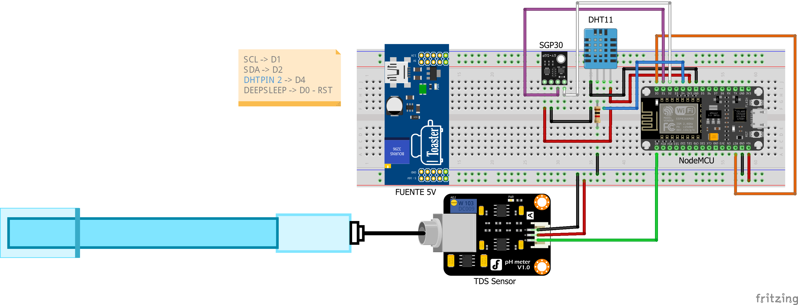

# Proyecto de Monitoreo de Calidad del Agua y del Aire con NodeMCU ESP8266

## Descripción

Este proyecto consiste en un sistema de monitoreo básico de **calidad del agua** y **calidad del aire** utilizando una placa **NodeMCU ESP8266**. Se integran sensores para medir:

- **TDS (Total de Sólidos Disueltos)** en el agua.
- **Compuestos orgánicos volátiles (TVOC)** y **dióxido de carbono equivalente (eCO2)** mediante el sensor **SGP30**.
- **Temperatura y humedad relativa** mediante un sensor **DHT11** usado para realizar compensación de la medición de TDS y por calculo realizar compensación de TVOC y eCO2 con humedad absoluta.

Los datos se envían a la plataforma en la nube **[Blynk](https://blynk.io/)** para su visualización en tiempo real desde dispositivos móviles o paneles web.

---

## Componentes del Sistema

| Componente               | Descripción                                                                 |
|--------------------------|-----------------------------------------------------------------------------|
| **NodeMCU ESP8266**      | Microcontrolador con conectividad WiFi integrada, ideal para IoT            |
| **Sensor TDS (DFRobot)** | Sensor para medir sólidos disueltos totales (TDS) en agua                   |
| **Sensor DHT11**         | Sensor digital de temperatura y humedad relativa                            |
| **Sensor SGP30**         | Sensor de gas para medir eCO₂ (CO₂ equivalente) y TVOC                      |
| **Resistencia 10kΩ**     | Resistencia pull-up para el pin de datos del sensor DHT11                   |
| **Protoboard**           | Tablero de pruebas sin soldadura para prototipado rápido                    |
| **Cables Dupont**        | Cables macho-macho / macho-hembra para realizar conexiones entre componentes |
| **Adaptador de voltaje** | Módulo step-up o cargador que regula la salida a 5V                         |
| **Batería recargable**   | Fuente de energía portátil para alimentar el sistema en campo               |

---

## Esquema de Conexión

_A continuación se muestra el diagrama de conexiones físicas del proyecto:_

---

## Librerías Arduino Requeridas

Asegúrate de instalar las siguientes librerías en el IDE de Arduino:

- `GravityTDS-master`
- `DHT11`
- `Adafruit_SGP30`  
- `Adafruit_Sensor`
- `Wire` (generalmente incluida por defecto)

---

## Funcionamiento

Al encenderse, el sistema establece una conexión WiFi utilizando las credenciales proporcionadas. En caso de fallar la conexión tras varios intentos, el dispositivo entra en modo de bajo consumo (*deepSleep*) durante 2 minutos antes de intentar reconectarse automáticamente.

Una vez conectado, el dispositivo inicia la lectura de datos ambientales a través de los sensores conectados:

1. **Sensor DHT11 (Temperatura y Humedad):**
   - Se toma una lectura de temperatura y humedad.
   - A partir de estos datos, se calcula la humedad absoluta para compensar adecuadamente las lecturas del sensor de calidad del aire SGP30.

2. **Sensor SGP30 (Calidad del Aire):**
   - El sensor se inicializa y se verifica que esté en condiciones adecuadas para realizar mediciones.
   - Se toman varias muestras del nivel de CO₂ equivalente (eCO₂) y compuestos orgánicos volátiles totales (TVOC), promediando los valores válidos.
   - La calidad del aire se clasifica según los niveles de eCO₂ registrados:
     - **Excelente:** eCO₂ < 600 ppm
     - **Bueno:** 600 - 799 ppm
     - **Regular:** 800 - 999 ppm
     - **Pobre:** 1000 - 1499 ppm
     - **Inaceptable:** ≥ 1500 ppm

3. **Sensor TDS (Sólidos Disueltos Totales en Agua):**
   - Se realizan múltiples lecturas analógicas para obtener un promedio confiable.
   - Se calcula la conductividad eléctrica (EC) y se aplica una compensación por temperatura.
   - A partir del EC, se obtiene el valor de TDS en ppm.
   - La calidad del agua se clasifica según el nivel de TDS:
     - **Excelente:** < 300 ppm
     - **Buena:** 300 - 599 ppm
     - **Regular:** 600 - 899 ppm
     - **Pobre:** 900 - 1199 ppm
     - **Inaceptable:** ≥ 1200 ppm

4. **Envío de Datos a la Plataforma Blynk:**
   - Todos los datos obtenidos (temperatura, humedad, TDS, EC, TVOC, eCO₂ y humedad absoluta) se envían a la aplicación móvil Blynk mediante pines virtuales.
   - También se utiliza un terminal virtual para visualizar los mensajes de estado y clasificación de calidad directamente desde la app.

Finalmente, tras completar el ciclo de mediciones y envío de datos, el dispositivo entra nuevamente en modo *deepSleep* durante 2 minutos para conservar energía, repitiendo el ciclo automáticamente.

Este diseño lo convierte en un sistema eficiente para el monitoreo ambiental, ideal para implementaciones autónomas en zonas donde se requiere vigilancia constante con bajo consumo energético.

---

## Plataforma en la Nube: Blynk

Utilizamos **[Blynk](https://blynk.io/)** como plataforma IoT para visualizar los datos de los sensores en tiempo real. Blynk permite crear interfaces móviles interactivas con botones, gráficas y widgets que se comunican con el hardware de forma remota.

---

## Posibles mejoras futuras

- Cambiar el sensor DHT11 por un **DHT22** para mayor precisión.
- Añadir sensores adicionales: **pH**, **turbidez**, **temperatura del agua**.
- Enviar los datos también a una base de datos o Google Sheets.
- Agregar una pantalla OLED local para mostrar valores en sitio.
- Implementar alertas automáticas por condiciones críticas.
- Usar un **panel solar** junto con la **batería recargable** para operación autónoma.

---

## Licencia

Este proyecto es de código abierto y puede ser utilizado con fines educativos, personales o de investigación.
